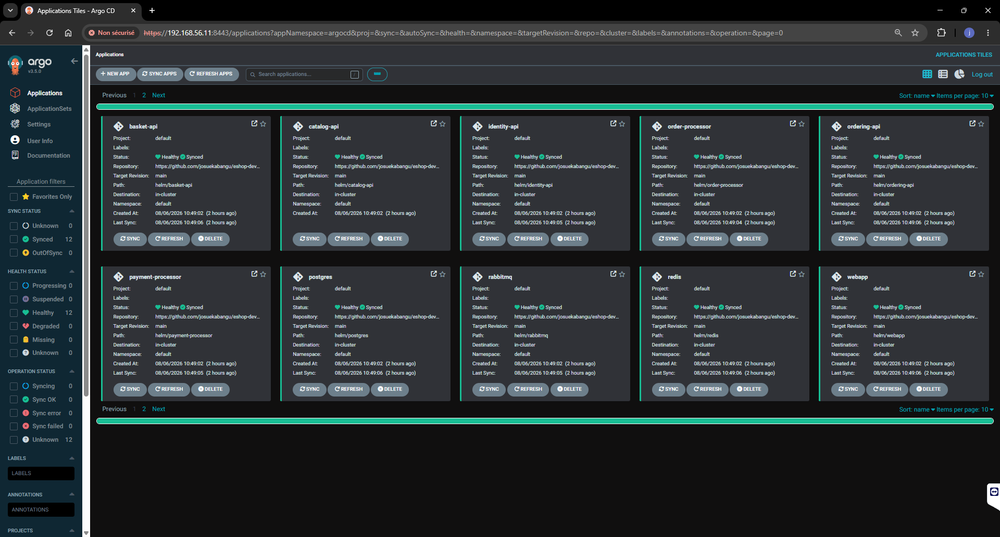

# eShop DevOps — Roadmap Junior to Senior

**Méthode Josue — Mentor DevOps Senior**
Projet central de la roadmap 12 mois vers Senior DevOps / Platform Engineer.

---

## 🎯 Objectif du projet

Prendre l'application de référence [dotnet/eShop](https://github.com/dotnet/eShop) et construire, à la main puis en l'automatisant progressivement, une chaîne DevOps complète : conteneurisation, orchestration Kubernetes, CI/CD, packaging Helm, GitOps. Rôle 100% infrastructure — zéro ligne de code applicatif écrite, uniquement consommée telle quelle.

---

## 🏗️ Architecture

```
┌─────────────────────────────────────────────────────────────┐
│                     VM Vagrant (Ubuntu 22.04)                │
│                        192.168.56.11                         │
│                                                                │
│  ┌──────────────────────────────────────────────────────┐   │
│  │                    Cluster K3s                         │   │
│  │                                                          │   │
│  │  Infra (StatefulSet)      Applicatif (Deployment)       │   │
│  │  ┌──────────┐             ┌──────────────┐              │   │
│  │  │ postgres │             │ catalog-api  │              │   │
│  │  │ rabbitmq │             │ identity-api │──[NodePort]──┼──▶ navigateur
│  │  │  redis   │             │ ordering-api │               │   │
│  │  └──────────┘             │  basket-api  │               │   │
│  │                            │ webhooks-api │               │   │
│  │                            │webhook-client│──[NodePort]──┼──▶ navigateur
│  │                            │order-processor│              │   │
│  │                            │payment-proc. │               │   │
│  │                            │    webapp    │──[NodePort]──┼──▶ navigateur
│  │                            └──────────────┘               │   │
│  └──────────────────────────────────────────────────────┘   │
│                                                                │
│  ┌──────────────────┐        ┌──────────────────────────┐    │
│  │  ArgoCD           │        │  Registre Docker local    │    │
│  │  (GitOps engine)   │        │  (bascule vers GHCR)      │    │
│  └──────────────────┘        └──────────────────────────┘    │
└─────────────────────────────────────────────────────────────┘
                              ▲
                              │ synchronisation continue
                              │
                    ┌──────────────────┐
                    │   GitHub Repo     │
                    │  (source de vérité)│
                    │                    │
                    │  docker/           │
                    │  k8s/              │
                    │  helm/             │
                    │  argocd/           │
                    │  .github/workflows/│
                    └──────────────────┘
                              │
                              │ push → déclenche
                              ▼
                    ┌──────────────────┐
                    │  GitHub Actions   │
                    │  (CI, matrix)     │
                    │  build → push     │
                    └──────────────────┘
                              │
                              ▼
                    ┌──────────────────┐
                    │  ghcr.io          │
                    │  (12 packages)     │
                    └──────────────────┘
```

---

## 📦 Stack technique

| Couche | Outils |
|---|---|
| Virtualisation | Vagrant + VirtualBox |
| Conteneurisation | Docker, Docker Compose |
| Orchestration | Kubernetes (K3s) |
| Packaging | Helm |
| GitOps | ArgoCD (+ ApplicationSet) |
| CI/CD | GitHub Actions (matrix build) |
| Registre d'images | GitHub Container Registry (ghcr.io) |
| IaC | Terraform, AWS (S3, VPC/networking, EC2, RDS en modules) |
| Config management | Ansible (K3s + ArgoCD idempotents sur EC2) |
| Application | .NET 10, PostgreSQL (pgvector), RabbitMQ, Redis |

---

## 📁 Structure du repo

```
EshopOnContainer/
├── vagrant/
│   └── Vagrantfile              # provisioning VM
├── eShop/                       # code source applicatif (dotnet/eShop)
├── docker/
│   ├── docker-compose.yml       # stack complète en local (référence historique)
│   ├── DOCKER.md                # doc Phase 1 — Dockerfiles, compose, bugs
│   └── scripts/postgres/        # script d'init des bases
├── src/                         # Dockerfiles des 9 services applicatifs
│   └── ESHOP.md                 # doc architecture applicative, patches OAuth2
├── registry/
│   ├── docker-compose.yml       # registre Docker local (dev, obsolète depuis CI)
│   └── REGISTRY.md
├── k8s/                         # manifests Kubernetes bruts (référence historique)
│   ├── MANIFEST.md              # doc migration Compose → K8s, toutes les étapes
│   ├── postgres/ rabbitmq/ redis/
│   └── catalog-api/ identity-api/ ordering-api/ ...
├── helm/                        # charts Helm (source de vérité actuelle)
│   ├── HELM.md                  # doc conversion K8s → Helm, tous les charts
│   ├── postgres/ rabbitmq/ redis/
│   └── catalog-api/ identity-api/ ordering-api/ ...
├── argocd/
│   ├── ARGOCD.md                # doc GitOps
│   └── eshop-applicationset.yaml # génère les 12 Applications ArgoCD
├── .github/
│   ├── CI.md                    # doc pipeline CI
│   └── workflows/build-push-all.yml
├── terraform/
│   ├── TERRAFORM.md             # doc IaC — pilote S3, modules networking + ec2 + rds
│   ├── main.tf variables.tf outputs.tf   # racine — appelle les modules
│   ├── networking/              # VPC, subnets publics ET privés, routage Internet
│   ├── ec2/                     # instance serveur, Security Group, clé SSH
│   └── rds/                     # base de données managée, isolée en subnet privé
├── ansible/
│   ├── ANSIBLE.md               # doc config management — K3s idempotent sur EC2
│   ├── ansible.cfg inventory.ini
│   └── k3s-install.yml
└── DEVOPS.md                    # index racine — stack, piliers, roadmap à jour
```

⚠️ **État actuel des sources de vérité, du plus ancien au plus récent** : `docker-compose.yml` et `k8s/*.yaml` sont des **références historiques**, conservées pour la documentation et l'apprentissage — le déploiement réel du cluster est piloté exclusivement par `helm/*` via ArgoCD. Ne plus modifier `k8s/*.yaml` pour faire évoluer un déploiement réel : modifier le chart Helm correspondant, committer, pousser.

---

## 📚 Index de la documentation

Chaque grande étape a sa doc colocalisée avec le code qu'elle décrit — pas de dossier `docs/` séparé, la documentation vit à côté de ce qu'elle documente.

| Document | Contenu |
|---|---|
| [DEVOPS.md](DEVOPS.md) | Index vivant : stack technique, piliers DevOps, roadmap, statuts à jour |
| [docker/DOCKER.md](docker/DOCKER.md) | Phase 1 — 9 Dockerfiles multi-stage, `docker-compose.yml`, 10 bugs diagnostiqués |
| [src/ESHOP.md](src/ESHOP.md) | Architecture applicative, 12 services, patches OAuth2 |
| [k8s/MANIFEST.md](k8s/MANIFEST.md) | Migration Compose → K8s : StatefulSets (postgres, rabbitmq, redis), Deployments (les 9 services applicatifs), tous les bugs par étape |
| [registry/REGISTRY.md](registry/REGISTRY.md) | Registre Docker local, interface web, bugs DNS interne/externe et CORS |
| [.github/CI.md](.github/CI.md) | Pipeline GitHub Actions, bascule vers GHCR, bug gitlink/`.gitignore`, workflow `matrix` |
| [helm/HELM.md](helm/HELM.md) | 12 charts Helm, décision "un chart par service", résolution structurelle du `${VAR}`, tous les bugs de templating |
| [argocd/ARGOCD.md](argocd/ARGOCD.md) | Installation ArgoCD, `ApplicationSet`, bug CRD, bilan final |
| [terraform/TERRAFORM.md](terraform/TERRAFORM.md) | IaC — fondamentaux Terraform, pilote AWS S3, modules `networking`/`ec2`/`rds` complets, isolation réseau validée par preuve fonctionnelle |
| [ansible/ANSIBLE.md](ansible/ANSIBLE.md) | Config management — K3s + ArgoCD idempotents sur EC2, incident de sécurité (clé AWS) et incident de capacité (RAM/disque) résolus |

---

## 🐛 Récapitulatif des dettes techniques assumées

| Dette | Description | Piste de résolution future |
|---|---|---|
| Secrets dupliqués entre charts Helm | Mot de passe Postgres/Redis/RabbitMQ existe en dur dans plusieurs `values.yaml` | Gestionnaire de secrets externe (Vault, AWS Secrets Manager) |
| `docker-entrypoint-initdb.d` pour la création des bases | Provisioning couplé au cycle de vie du StatefulSet Postgres | `Job` Kubernetes dédié |
| Probes `tcpSocket` plutôt que health check applicatif réel | Ne vérifie que l'ouverture du port, pas la santé fonctionnelle | Endpoint `/readyz` minimal, non conditionné à `Development` |
| Data Protection Keys non persistées | Perte de session possible en cas de scaling multi-réplicas | `PersistKeysToStackExchangeRedis` ou équivalent |
| Packages GHCR publics | Pas d'authentification requise pour puller les images | `imagePullSecret` + packages privés |
| Tag `latest` utilisé dans les manifests Helm | Pas de garantie de version figée | Référencer le SHA du commit (`${{ github.sha }}`) |
| State Terraform local (`terraform.tfstate`) | Pas de verrouillage, pas de partage d'équipe, risque de perte locale | Backend distant S3 + verrouillage DynamoDB |
| `skip_final_snapshot = true` sur RDS | Aucun snapshot conservé à la destruction de l'instance | À retirer avant tout scénario proche de la production |

---

## 🚀 Démarrage rapide (état actuel du cluster)

```bash
# Accès à l'application
http://192.168.56.11:5100        # webapp (frontend principal)
http://192.168.56.11:5223        # identity-api (login OAuth)
http://192.168.56.11:5114        # webhook-client
https://192.168.56.11:8443       # ArgoCD UI

# Vérifier l'état du cluster
kubectl get pods
kubectl get applications -n argocd

# Modifier un composant (le seul chemin légitime)
# 1. Éditer helm/<service>/values.yaml
# 2. git add, commit, push
# 3. ArgoCD synchronise automatiquement (selfHeal actif)
```



---

## 🗺️ Position dans la roadmap 12 mois

Ce projet couvre intégralement les objectifs **Phase 1 (GitOps & CI/CD)**, avec une avance significative sur des éléments typiquement **Phase 2/3** (GitOps avancé via ArgoCD, packaging Helm complet). La branche Terraform (pilote S3, modules `networking`/`ec2`/`rds`) et Ansible (K3s + ArgoCD idempotents sur l'EC2, sous-ensemble `postgres`+`catalog-api` déployé) complètent la Phase 2 IaC — infrastructure AWS entièrement provisionnée en code, sécurité réseau vérifiée par preuve fonctionnelle. Deux incidents réels traités de bout en bout durant cette phase — sécurité (clé AWS exposée, quarantaine automatique AWS) et capacité (saturation RAM/disque sur `t3.small`, résolue par swap + désactivation de composants ArgoCD non essentiels) — voir `ansible/ANSIBLE.md`. Reste comme dette technique tracée : backend distant du state Terraform (S3 + DynamoDB).

---

*Méthode Josue — Mentor DevOps Senior.*
